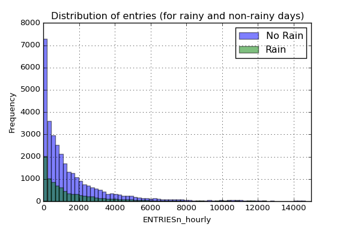
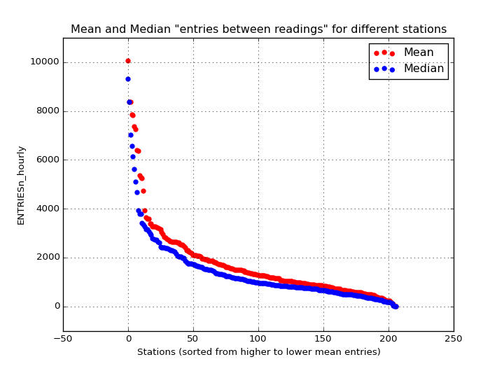
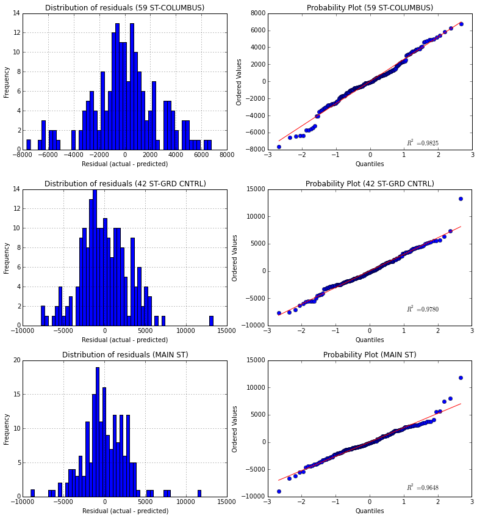

# Analyzing the NYC Subway Dataset

> This project has been developed in order to pursue the [Data Analyst Nanodegree](https://www.udacity.com/course/data-analyst-nanodegree--nd002) offered by Udacity. Specifically, the project aims to use the knowledges acquired in the first course of this Nanodegree: [Intro to Data Science](https://www.udacity.com/course/ud359-nd). 
> 
> The *Short Questions* answers about the data analysis can be found [here](./ShortQuestions.md).

## 1 Introduction

The aim of this project is to evaluate **whether or not more people ride the subway in New York City when it is raining than when it is not raining**, that is, if there is a significant difference between the riderships on rainy days and non-rainy days. To reach this goal, we are going to analyze the [NYC Subway data set](https://www.dropbox.com/s/meyki2wl9xfa7yk/turnstile_data_master_with_weather.csv) provided by Udacity (also available [here](./notebooks/improved-dataset/turnstile_weather_v2.csv)). This data set corresponds to the month of May 2011 and can be accessed through the main source in the web page of the MTA, in the [Developer Resources section](http://web.mta.info/developers/index.html).

## 2 Statistical Test

### 2.1 Analyzing the data

The given data comes in a [csv](http://en.wikipedia.org/wiki/Comma-separated_values) format, consisting of a numerical index (integer) and a series of columns representing different measurements of the MTA system. These columns and their associated values are described [here](./notebooks/improved-dataset/turnstile-weather-variables.pdf).

The variable that we are analyzing is `ENTRIESn_hourly` which is not a measure of the *entries per hour*, instead it measures the number of entries between readings. That gap of time could be 4, 8, 12, 16 or even 20 hours. However, the majority of measures have been made with a gap of time of 4 hours (96%), then with a gap of 8 hours (3,7%) and so on. You can reach more info on the [corresponding Notebook](./notebooks/HoursDifference.ipynb).

We want to analyze wether or not the entries varies depending on if it is raining or not. We can plot an histogram of the entries per hour, differentiating for both situations:

As we can see in the figure , there is much more entries for the non-rainy days, which means that most of the data correspond to non-rainy days. Note that the x-axis has been truncated up to 15.000 *entries per reading* to allow more clarity in the visualization (we have values up to 32.814 entries). In addition to that figure, we can take a look at some statistic parameters of both distributions:

|          | Rain        | No Rain     | 
| :------- | :---------- | :---------- | 
| Count    | 9585        | 33064       | 
| **Mean** | **2028.20** | **1845.54** | 
| std      | 3189.43     | 2878.77     | 
| min      | 0           | 0           | 
| 25%      | 295         | 269         | 
| 50%      | 939         | 893         | 
| 75%      | 2424        | 2197        | 
| max      | 32289       | 32814       | 

This data we are analyzing corresponds to the aggregate data (from all remote units). As we can see in the table below, there is a difference in the mean on both populations, so is our task to determine if they are **significantly** different. Note that this *rain/no-rain tag* that we have added to our data corresponds to when it had been raining within a day, so it could be possible that some data points are *tagged* with a *rain* when it was not raining at that specific moment in time (but it rained on that day).

Just for having a big picture of the overall behavior we could analyze the ridership for the hole month, including the measure of *mean* and *median* for each day and an encoding of the amount of precipitations:

That blue line also allows us not only to view the average `ENTRIESn_hourly` but also the difference between the different days of the week. Starting the month on Sunday, we see that in the weekends the average use of the subway is considerably less, reaching the minimum of the week on sunday.

The green line tells us almost the same information that the blue one. However, the difference between the median and the mean reflects the high number of *outliers* among all the data. Those outliers can also be viewed in the orange *scatter plot*. The high dispersion of the data and its high number of outliers says that maybe different stations have a very different average passengers (the intuition also says the same). We only have to take a look to the *mean* curve to notice the power of the *outliers* here.

Due to the fact that we have analyzed the difference on ridership when it is raining I have also added the information of the amount of precipitations in inches. By this way we have the information about what days had been raining and also the amount of precipitations.

### 2.2 Statistical significance

If we want to know if there is a significant difference between the two distributions, that is, if people use the train more often when it is raining than when it is not, we need to make a hypothesis testing with a **Mann-Whitney U test**. This kind of test will allow us to determine whether or not there is a significance difference between the two populations, which is the same as saying that the means are different. In this case we can’t conduct a t-test cause the distributions are not normal, so we use a non-parametric test like Mann-Whitney U test. With this premise in mind we can construct our null and alternative hypothesis to evaluate:

Therefore, our test will be **non-directional (two-tailed)**, since we want to prove what our intuition tell us, that when it is raining more people will take the subway (we cannot assume in advance -before we collect the data- that rain will not be associated with lower ridership). Also we will select a significance level of **alpha = 0.05**.

Given these parameters, we conduct the Mann-Whitney U test and we get a **p-value = 5.48e-06**, which is clearly lower than the critical value, so we would **reject the null hypothesis**. That means that **more people ride the subway in New York City when it is raining than it is not raining** (in other words, it is not likely due to chance to get this difference between the two data).

**NOTE:** The associated IPython notebook could be found [here](./notebooks/StatisticalTest.ipynb). Here we can also see that if we split the data differentiating between different stations and we conduct the statistical test for each of them, we will not reject the null for each of the station, indeed, we would only say that in one of the stations significantly more people ride the subway when it is raining.

## 3 Linear Regression

In order to get predictions about how many people will ride the subway depending on weather conditions and time we will build a regression model. That regression model will be based on the given data explained above, using the characteristics that best lead to a good predicted values.

In all analysis that I have made there is always a huge dispersion in data caused by the difference between stations. We have stations with an average ridership much higher than the rest so our model should not include all the data for making a predicting model. Another option we have is to create dummy variables for different stations, so that our regression would calculate a higher theta value for those stations with more people riding the subway.

### 3.1 Aggregated-data regression model

**3.1.1 Algorithm**

In order to compute the regression model (theta coefficients) for the aggregated data (without differentiating between stations) the chosen method is *OLS*. However, *Gradient Descent* has also been used for comparing purposes. 

The reason of choosing *OLS* as the main method is that it gives a close solution of the minimum of the cost function, whereas *Gradient Descent* solution is not as accurate and could give us a *local minimum* (not the *global* one). In this case the amount of data is not a problem for *OLS*, so we do not need the inherit speed of *Gradient Descent* in this case.

**3.1.2 Variables**

The included variables as one-order terms into the regression model are the following: `hour`, `day_week`, `weekday`, `fog`, `precipi`, `pressurei`, `rain`, `tempi` and `wspdi`. Other high-grade terms have been also included to the regression model (from *order 2* up to *order 10* depending on the specific characteristic and the results that it provides in the final model). This *high-order terms* include the variables: `hour`, `precipi`, `DAYn`, `day_week`, `pressurei`, `tempi` and `wspdi` (where `DAYn` is the day of the month).

Some *dummy variables* have been also included, separating *data points* with different values of `UNIT` and `conds`.

In a first approach, the variables that intuitively have a direct relation with the number of people that ride the subways have been chosen, such as the weather variables (the worst the weather, the more people will ride the subway) and other time constraints variables (there has to be *peak* hours and there could be a difference between weekday and non-weekday days). 

Based on this intuition, an analysis of the influence of the different variables on a regression model and its Coefficient of Determination could be made to visualize those relationships, getting a more specific vision about how each variable influences the number of entries, so that it could be advantageous adding *dummy* variables or *high-order terms* in the regression model (for variables that clearly does not follow a linear curve).

In the case of the *dummy* variables, there is a high difference between the passengers for different stations, which produces a high dispersion in the *scatter plot* if we do not desegregate this data for different stations (or units). The reason to add another *dummy* variable for `conds` is based on the analysis of the R2 value obtained (which is better with the variable that without it).

There are three different Notebooks that have been used for the variable analysis, which can be reached [here](./notebooks/reg1.ipynb), [here](./notebooks/reg2.ipynb) and [here](./notebooks/reg3.ipynb).

**3.1.3 Regression Model**

The result of applying *OLS* is a **Coefficient of Determination** parameter of **0.5513**. This R2 values says that **55.13 %** of variability of the `ENTRIESn_hourly` parameter could be determined with the different variables that has been used in the regression model (weather and time).

To quantify if this model could be appropriate for predicting the ridership we should take a look at the residuals to see whether or not they are distributed normally, in which case our model would be a great model, or they do not follow a normal distribution and then we have a poor regression model. In the following figure we can see both the histogram and the probability plot of the residuals (actual values - predicted values) for our regression model.

So given the R2 parameters we could say that is a good estimation, whereas if we take a look to the above figures we would not say the same. We can see that the histogram of the residuals has long tails (specially the right tail) and this effect can also be viewed in the probability plot, that tells us that the distribution is clearly not-normal. The presence of high residuals tells us that there is a considerable quantity of values for *actual values* that our model is not able to reproduce, giving those high values of residuals that can be viewed in both tails of the histogram and also in the points that move away the straight red line in the *probability plot*.

### 3.2 Regression model for each station

There is a high difference between riderships for different stations. This difference could be appreciated in the *scatter plot* of the *entries per reading* where we have a high number of *dispersion* and also a huge amount of *outliers*. The quickest way to visualize this is *plotting* the entries on each station:

In the above figure we can see the mean and median values for the different stations. As we can see, this huge difference between stations will create a regression model with the aggregated data that may not be as precise and accurate as it could be if we split the data for the different stations and create a model for each one of them.

In order to support this theory of the station-splitting-analysis in someway, different stations have been analyzed and a regression model has been created for each of them individually. The result could be viewed in the following image:

I have chosen the 3 stations with higher mean entries (for making the comparison easier). The presented curves correspond to the same pattern I used to discuss the regression model for the aggregated data, that is, an histogram and a probability plot of the residuals. In this case the regression model created is much more accurate than before, reaching a R2 value of 0.8948 for the **59 ST-COLUMBUS** station, which means that the **89,48%** of the variability in the entries for this station could be explained by external variables like the weather and the time.

In this case we have to take care because splitting the data also means that we will have less samples for each group, so there could be a case in which we do not have enough information to build a regression model (or the model would be wrong, for example if for one station we do not have data for rainy days).

