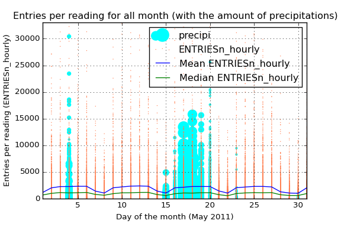

# Analyzing the NYC Subway Dataset

## Section 0. References

- \[1] [OLS vs Gradient Descent](http://stackoverflow.com/questions/18191890/why-gradient-descent-when-we-can-solve-linear-regression-analytically)
- \[2] [Are the model residuals well-behaved?](http://www.itl.nist.gov/div898/handbook/pri/section2/pri24.htm)
- \[3] [Interpreting residual plots to improve your regression](http://docs.statwing.com/interpreting-residual-plots-to-improve-your-regression/)
- \[4] [Interpret the key results for simple regression](http://support.minitab.com/en-us/minitab-express/1/help-and-how-to/modeling-statistics/regression/how-to/simple-regression/interpret-the-results/key-results/)

## Section 1. Statistical Test

**1.1 Which statistical test did you use to analyze the NYC subway data? Did you use a one-tail or a two-tail P value? What is the null hypothesis? What is your p-critical value?**

I have used a non-directional (two-tailed) Mann-Whitney U test  with a significance level of 0.05. The null hypothesis is that there is no difference between ridership for rainy and non-rainy days. The alternative hypothesis will be that when it is raining significantly more (or less) people will take the subway.

**1.2 Why is this statistical test applicable to the dataset? In particular, consider the assumptions that the test is making about the distribution of ridership in the two samples.**

This test does not assume any kind of characteristics about the distribution, so is a non-parametric test, which is very useful to us regarding that our data does not follow a normal distribution.

**1.3 What results did you get from this statistical test? These should include the following numerical values: p-values, as well as the means for each of the two samples under test.**

After conducting the test I get a p-value = 5.48e-06. The samples we are testing have the following means:

- Rain: 2028.20 entries between readings on average
- No-Rain: 1845.54 entries entries between readings on average

**1.4 What is the significance and interpretation of these results?**

Regarding this results, we would conclude that significantly more people ride the subway when it is raining than when it is not raining: we would reject the null hypothesis with a significance level of 5.48e-06 (for a two-tailed test).

## Section 2. Linear Regression

**2.1 What approach did you use to compute the coefficients theta and produce prediction for ENTRIESn_hourly in your regression model:**

1. **OLS using Statsmodels or Scikit Learn**
2. **Gradient descent using Scikit Learn**
3. **Or something different?**

I have used primarily OLS using *Statsmodels*, but I have made also some tests with the Gradient Descent algorithm that I implemented during the course. 

The reason for using primarily the OLS algorithm instead of Gradient Descent is that it gives the minimum of the cost function. The Gradient Descent could be advantageous in situations that we have a huge amount of data to process, because it will be faster [1].

**2.2 What features (input variables) did you use in your model? Did you use any dummy variables as part of your features?**

I have used the following variables as linear terms for the regression model: `hour`, `day_week`, `weekday`, `fog`, `precipi`, `pressurei`, `rain`, `tempi` and `wspdi`. I have also added some other high-grade terms to the regression model (from *order 2* up to *order 10* depending on the specific characteristic and the results that it provides in the final model). This *high-order terms* include the variables: `hour`, `precipi`, `DAYn`, `day_week`, `pressurei`, `tempi` and `wspdi` (where `DAYn` is the day of the month).

I have aso included some *dummy* variables, separating *data points* with different values of `UNIT` and `conds`.

**2.3 Why did you select these features in your model? We are looking for specific reasons that lead you to believe that the selected features will contribute to the predictive power of your model.**

- **Your reasons might be based on intuition. For example, response for fog might be: “I decided to use fog because I thought that when it is very foggy outside people might decide to use the subway more often.”**
- **Your reasons might also be based on data exploration and experimentation, for example: “I used feature X because as soon as I included it in my model, it drastically improved my R2 value.”**

In a first approach I selected those variables that intuitively have a direct relation with the number of people that ride the subways, such as the weather variables (the worst the weather, the more people will ride the subway) and other time constraints variables (there has to be *peak* hours and there could be a difference between weekday and non-weekday days). 

Based on this intuition I have made an analysis of the influence of the different variables on a regression model and its Coefficient of Determination. I have made also an individual analysis of the influence of the different variables to the `ENTRIESn_hourly` variable, creating different visualizations like a *scatter plot*, a *regression line*, a *LOESS* curve and also plotting the evolution of the *mean* and *median* values of `ENTRIESn_hourly` for different other variables. After this individual analysis I got a more specific vision about how each variable influences the number of entries, so that it could be advantageous adding *dummy* variables or *high-order terms* in the regression model (for variables that clearly does not follow a linear curve).

In the case of the *dummy* variables, there is a high difference between the passengers for different stations, which produces a high dispersion in the *scatter plot* if we do not desegregate this data for different stations (or units). The reason to add another *dummy* variable for `conds` is based on the analysis of the R2 value obtained (which is better with the variable that without it).

**2.4 What are the coefficients (or weights) of the non-dummy features in your linear regression model?**

For the OLS regression model: 

- y-intercept: `[91.81604036]`
  
- `['hour', 'day_week', 'weekday', 'fog', 'precipi', 'pressurei', 'rain', 'tempi', 'wspdi']`: `[251.60958223, 54.26412209, 5.15990429, -844.41927264, -4433.78226047, 19.50560816, -47.41895306, 7.79552114, -381.63655189]`
  
- For *high-level coefficients*:
  
  - From `hour`^2 to `hour`^7: `[-5.13371030e+01, -8.48858638e+01, 2.43511841e+01, -2.44115321e+00, 1.05644031e-01, -1.67913677e-03]`
  - From `precipi`^2 to `precipi`^7: `[-1.07601557e+03, -2.49645994e+02, -7.65339325e+01, 6.63667953e+00, 1.53174242e+01, 8.63876977e+00]`
  - From `DAYn`^2 to `DAYn`^9: `[-5.10069717e+01, 1.14121069e+01, -1.84865398e+00, 2.37053963e-01, -1.86161864e-02, 8.07465475e-04, -1.78341838e-05, 1.56831062e-07]`
  - From `day_week`^2 to `day_week`^9: `[4.98824513e+01, 1.68135796e+01, -1.22910788e+01, -1.62929551e+01, 9.61846145e+00, -1.40679451e+00, -2.82037026e-02, 1.27466191e-02]`
  - From `pressurei`^2 to `pressurei`^6: `[1.42505748e+02, -7.28049102e+01, -3.63362764e-01, 2.44293778e-01, -5.23382498e-03]`
  - From `tempi`^2 to `tempi`^5: `[2.81001114e+01, -8.32763244e-01, 9.18182005e-03, -3.59854775e-05]`
  - From `wspdi`^2 to `wspdi`^8: `[2.57483634e+02, -7.23596531e+01, 1.12261615e+01, -1.02458131e+00, 5.42489061e-02, -1.52988140e-03, 1.76633365e-05]`

**2.5 What is your model’s R2 (coefficients of determination) value?**

The Coefficient of Determination obtained with this regression model is `0.5513041512348551`.

**2.6 What does this R2 value mean for the goodness of fit for your regression model? Do you think this linear model to predict ridership is appropriate for this dataset, given this R2 value?**

This R2 values says that *55.13 %* of variability of the `ENTRIESn_hourly` parameter could be determined with the different variables that I have used in the regression model.

To give a response about the viability of using this model for predicting the ridership we could use a visualization of the redisual’s distribution in a *histrogram plot*. We could also add a *probability plot* to analyze whether or not the residuals follow a normal distribution. Residuals can be thought of as elements of variation unexplained by the fitted model. Since this is a form of error, the same general assumptions apply to the group of residuals that we typically use for errors in general: *one expects them to be (roughly) normal and (approximately) independently distributed with a mean of 0 and some constant variance* \[2].

So given the R2 parameters we could say that is a good estimation, whereas if we take a look to the above figures we would not say the same. We can see that the histogram of the residuals has long tails (specially the right tail) and this effect can also be viewed in the probability plot, that tells us that the distribution is clearly not-normal. The presence of high residuals tells us that there is a considerable quantity of values for *actual values* that our model is not able to reproduce, giving those high values of residuals that can be viewed in both tails of the histogram and also in the points that move away the straight red line in the *probability plot* and make that *S shape*.

## Section 3. Visualization

**Please include two visualizations that show the relationships between two or more variables in the NYC subway data.**

**Remember to add appropriate titles and axes labels to your plots. Also, please add a short description below each figure commenting on the key insights depicted in the figure.**

**3.1 One visualization should contain two histograms: one of  ENTRIESn_hourly for rainy days and one of ENTRIESn_hourly for non-rainy days.**

Here we can see a plot of the histogram for `ENTRIESn_hourly` variable for both rainy and non-rainy days. As we can see in the figure below, there is much more entries for the non-rainy days, which means that most of the data correspond to non-rainy days.

Note that the x-axis has been truncated up to 15.000 *entries per reading* to allow more clarity in the visualization (we have values up to 32.814 entries).

**3.2 One visualization can be more freeform. You should feel free to implement something that we discussed in class (e.g., scatter plots, line plots) or attempt to implement something more advanced if you'd like. Some suggestions are:**

- **Ridership by time-of-day**
- **Ridership by day-of-week**

In the following visualization I tried to add as much relevant data as I could. We have a *scatter plot* of the `ENTRIESn_hourly` parameter, which refer to the number of *entries between readings*. I have also added two lines to visualize the mean and median value for that entries and a *volume scatter plot* encoding the amount of precipitations in inches for the different days of the month.

That blue line also allows us not only to view the average `ENTRIESn_hourly` but also the difference between the different days of the week. Starting the month on Sunday, we see that in the weekends the average use of the subway is considerably less, reaching the minimum of the week on sunday.

The green line tells us almost the same information that the blue one. However, the difference between the median and the mean reflects the high number of *outliers* among all the data. Those outliers can also be viewed in the orange *scatter plot*. The high dispersion of the data and its high number of outliers says that maybe different stations have a very different average passengers (the intuition also says the same). We only have to take a look to the *mean* curve to notice the power of the *outliers* here.

Due to the fact that we have analyzed the difference on ridership when it is raining I have also added the information of the amount of precipitations in inches. By this way we have the information about what days had been raining and also the amount of precipitations.

## Section 4. Conclusion

**Please address the following questions in detail. Your answers should be 1-2 paragraphs long.**

**4.1 From your analysis and interpretation of the data, do more people ride the NYC subway when it is raining or when it is not raining?**  

Given the parameters for the two populations (rainy and non-rainy days), we conduct the Mann-Whitney U test and we get a **p-value = 5.48e-06**, which is clearly lower than the critical value, so we would **reject the null hypothesis**. That means that **significantly more people ride the subway in New York City when it is raining than when it is not raining** (in other words, it is not likely due to chance to get this difference between the two data if they were not different).

We can also see that difference if we visualize the ridership for both situations, rainy and non-rainy days, through almost any visualization where we split the data for both situations.

**4.2 What analyses lead you to this conclusion? You should use results from both your statistical tests and your linear regression to support your analysis.**

Regarding the resulting p-value given by the Mann-Whitney U test, we would conclude that significantly more people take the subway when it is raining than when it is not raining. Moreover, the analysis of the `ENTRIESn_hourly` variable shows that in every situation we split the data for both populations, the curve for rainy-days shows a higher ridership.

Additionally to the statistical test, we can see in the regression model built that there is a big influence of the weather conditions on the quantity of people that take the subway. However, the huge difference between the quantity of ridership depends on the stations we are analyzing, so it could be interesting to create a regression model for each individual station in order to reduce the variability in the *entries per reading* variable.

## Section 5. Reflection

**Please address the following questions in detail. Your answers should be 1-2 paragraphs long.**

**5.1 Please discuss potential shortcomings of the methods of your analysis, including:**

1. **Dataset,**
2. **Analysis, such as the linear regression model or statistical test.**

For the conduction of this analysis I have used the [improved data set](https://www.dropbox.com/s/1lpoeh2w6px4diu/improved-dataset.zip?dl=0) provided by Udacity. In this dataset, the first thing we should notice is that the main variable we are analyzing, `ENTRIESn_hourly` is not a measure of the *entries per hour*, instead it measures the number of entries between readings. That gap of time could be 4, 8, 12, 16 or even 20 hours. However, the majority of measures have been made with a gap of time of 4 hours (96%), then with a gap of 8 hours (3,7%) and so on.

Furthermore, I have create an additional variable measuring the *entries per hour*, but due to the fact that most of the measures have almost the same gap between measures, the result is approximately the same than using the initial `ENTRIESn_hourly` variable.

The main shortcoming in the analysis and also in creating the regression model is the high difference between riderships for different stations. This difference could be appreciated in the *scatter plot* of the *entries per reading* where we have a high number of *dispersion* and also a huge amount of *outliers*. Regarding this situation, I have created a new visualization to better understand the behavior of this characteristic:

In the above figure we can see the mean and median values for the different stations. As we can see, this huge difference between stations will create a regression model with the aggregated data that may not be as precise and accurate as it could be if we split the data for the different stations and create a model for each one of them. This difference between stations produce a regression model that adjust for lower values of entries, but is very inefficient for higher values as we have seen in the figure on 2.6.

Other shortcoming that we could take into account is that in this dataset we only have data for one month, May 2011. In this month we have only a few rainy days, and also the amount of precipitations differs a lot between these days and also between stations. So here again, it could be very advantageous to split the data analysis for each station individually. As we could see in the figure on 3.2, whereas in some days that difference is not so big, other days we have a much higher difference. In this case I have selected the amount of precipitations because we are trying to analyze the effect of the rain (mainly), however other weather variables could also have a high dispersion for different stations.

**5.2 (Optional) Do you have any other insight about the dataset that you would like to share with us?**

Just to support my theory of the station-splitting-analysis in someway, I have analyzed different stations and created a regression model for each of them individually. The result could be viewed in the following image:

In this case I have chosen the 3 stations with higher mean entries (for making the comparison easier). The presented curves correspond to the same pattern I used to discuss the regression model in 2.6, that is, an histogram and a probability plot of the residuals. In this case the regression model created is much more accurate than before, reaching a R2 value of 0.8948 for the *59 ST-COLUMBUS* station, which means that the *89,48%* of the variability in the entries for this station could be explained by external variables like the weather and the time.

|                                  | 59 ST-COLUMBUS  | 42 ST-GRD CNTRL | MAIN ST         | 
| -------------------------------- | --------------- | --------------- | --------------- | 
| **Coefficient of Determination** | 0.8948 (89.48%) | 0.8152 (81.52%) | 0.7828 (78.28%) | 

In this case we have to take care because splitting the data also means that we will have less samples for each group, so there could be a case in which we do not have enough information to build a regression model (or the model would be wrong, for example if for one station we do not have data for rainy days).

We could also keep digging on this analysis by plotting the residual per data point. In the image below we can see different plots for different range of values: 

In each column we have different visualizations: a *scatter plot*, a *line plot* and then a combination of both. In the case of the first column I created the plot with a low alpha value to help visualize where the points concentrate more. I have also chosen different ranges to visualize on each row, with all the data points in the first row, ending with the range from 1.200 to 1.300 data points. Note that the residuals have been standardized (or semi-studentized).

In these graphics we can see that there is a pattern in the evolution of the residuals (mainly in the 4th row), so that may indicate that residuals near each other may be correlated, and thus, not independent. As we have discuss before, the residuals should ideally fall randomly around the center (following a normal distribution). So we could conclude that the model we could not reach the non-linearity that is inherit at this variables through our regression model.

If we make the same analysis for some of the individual regression model created for each station we can see that the plots look more like a randomly generated points, that is, the residuals are more close to the random distribution (but we already knew that for our analysis before):

So in this case the generated regression model fits better the variables and make more accurate predictions.

Another analysis we could do about the residuals is through the visualization called *the residual plot*. In this plot we have the predicted values on the x-axis and the residuals on the y-axis (standardized residuals in this case), so each point is a measure of entries, where the prediction made by the regression model is on the x-axis, and the accuracy of the prediction is on the y-axis. The distance from the line at 0 is how bad the prediction was for that value.

In this case I have plotted first the model with the aggregated data and the the correspondent models for the stations analyzed before. Here we can also see the difference between the first *general* model and the *individual* models. In the first case we have a non-constant variance and the model cannot fit the data because of the high non-linearity and the huge amount of outliers. 

As we intuitively state before, the difference between the riderships between different stations make almost impossible to generate a regression model that fits to all of them (even if we add the station parameters as a *dummy* variable), so it would be a wise option to create a separate model for each of the stations.